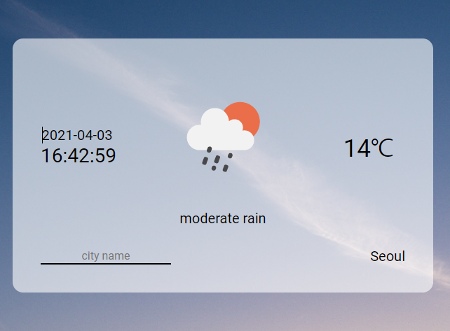

## 날씨 어플



fatch 사용

```js
  fetch(API_URL_OpenWeatherMap)
    .then(function (resp) {
      return resp.json();
    })
    .then(function (json) {
      ...
    }
```

`.then(function (json)){...}` 내부 코드

```js
function renderWeatherData() {
  // 1️⃣ 날짜 표시
  {
  }

  // 2️⃣ 시간 표시
  setInterval(function () {
    time.textContent = new Date().format2();
  }, 1000);

  // 3️⃣ 온도 표시
  {
  }

  // 4️⃣ 아이콘 표시
  descriptionIcon.setAttribute(
    "src",
    `http://openweathermap.org/img/wn/${json.weather[0].icon}@4x.png`
  );
}
```

1️⃣ 날짜 표시

- 예전에 트위틀러 과제 DATA.js에 들어있던거 긁어서 사용

2️⃣ 시간 표시

- `setInterval()` 사용, 1초마다 업데이트
- 날짜와 같이 DATA.js에서 훔친 코드 사용

3️⃣ 온도 표시

- 켈빈 온도 => 섭씨

4️⃣ 아이콘 표시

- 공식 문서에 있던 링크로 이미지 표시

간략하게 짜서 적을게 없다..

### ToDo

- [ ] Fetch
- [ ] async & await
