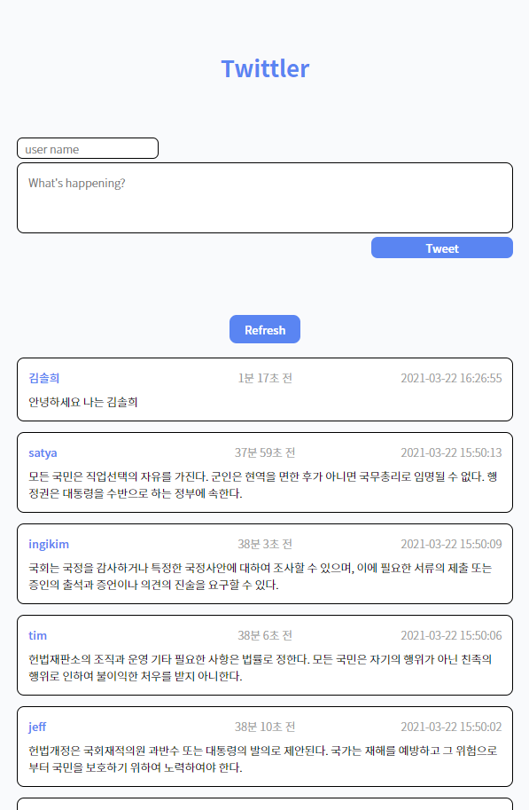

## 트윗 작성 기능

### 기존에 있던 데이터를 화면에 표시

1. DATA객체에 있던 데이터를 로컬스토리지에 저장(로컬스토리지에 "DATA"가 없다면)

```js
if (!localStorage.getItem("DATA")) {
  localStorage.setItem("DATA", JSON.stringify({ DATA }));
}
```

- `JSON.stringify`
- `JSON.parse`

2. 로컬스토리지에 있는 데이터를 화면에 표시

```js
function localStorageDataHandler(arr) {
  arr.forEach((data) => {
    let newTweet = makeCommentElement(data); // 요소를 만드는 함수
    readingArea.appendChild(newTweet); // 만든 요소를 화면에 표시
  });
}
localStorageDataHandler(localStorageDataJSON); // 로컬스토리지에 저장된 값을 인자로 받는다
```

<br />

### 유저가 새 트윗을 작성

```js
submitBtn.addEventListener("click", function (e) {
  e.preventDefault(); // submit버튼 기능 초기화
  if (inputUserName.value !== "" && inputContents.value !== "") {
    deleteAllLiElm(); // ul태그의 자식을 모두 지우는 함수
    localStorageDataHandler(localStorageDataJSON); // 로컬스토리지 데이터를 화면에 표시하는 함수

    let tweet = {};
    tweet.user = inputUserName.value;
    tweet.message = inputContents.value;
    tweet.created_at = new Date().format();
    addLS(tweet); // 새로 작성한 트윗을 로컬스토리지에 추가하고, 화면에 표시하는 함수

    // input 입력값 초기화
    inputUserName.value = "";
    inputContents.value = "";

    // 새로운 트윗에 필터링 기능 추가
    tweetName = document.querySelectorAll(".tweet_name");
    userFilter();
  }
});
```

`addLS()`함수

```js
function addLS(tweet) {
  // 인자로 받아온 객체 로컬스토리지에 저장
  localStorageDataJSON.unshift(tweet);
  localStorage.setItem("DATA", JSON.stringify({ localStorageDataJSON }));

  // 화면에 표시
  let newTweet = makeCommentElement(localStorageDataJSON[0]);
  readingArea.prepend(newTweet);
}
```

- `insertBefore()` => `prepend()`

<br />

### 이름 클릭 시 필터링

```js
let tweetName = document.querySelectorAll(".tweet_name");

function userFilter() {
  // 필터링 후
  function userFilteringHandler(e) {
    deleteAllLiElm(); // ul 태그 자식 모두 삭제
    let userFilterArr = localStorageDataJSON.filter((data) => {
      return data.user === e.target.textContent;
    }); // 필터링

    localStorageDataHandler(userFilterArr); // 필터링 된 데이터를 화면에 표시
  }

  tweetName.forEach((elm) => {
    elm.addEventListener("click", userFilteringHandler);
  });
}
userFilter();
```

<br />
### 작성한지 얼마나 되었는지 구하기

```js
setInterval(() => {
  const dateTime = document.querySelectorAll(".datetime");
  dateTime.forEach((dateTime) => {
    let curTime = new Date().getTime();

    let tweetWriteTime = dateTime.nextElementSibling.textContent;
    let tweetTimearr = tweetWriteTime.split(" ");
    let tweetTimearrstr = tweetTimearr.join(":");
    let tweetTime = new Date(tweetTimearrstr).getTime();
    let ms = curTime - tweetTime;
    let y = Math.floor(ms / 1000 / 60 / 60 / 24 / 365); //년
    let d = Math.floor((ms / 1000 / 60 / 60 / 24) % 365); //일
    let h = Math.floor((ms / 1000 / 60 / 60) % 24); //시간
    let m = Math.floor((ms / 1000 / 60) % 60); //분
    let s = Math.floor((ms / 1000) % 60); //초
    if (y !== 0) {
      dateTime.textContent = `${y}년 ${d}일 전`;
    } else if (d !== 0) {
      dateTime.textContent = `${d}일 ${h}시간 전`;
    } else if (h !== 0) {
      dateTime.textContent = `${h}시간 ${m}분 전`;
    } else if (m !== 0) {
      dateTime.textContent = `${m}분 ${s}초 전`;
    } else {
      dateTime.textContent = `${s}초 전`;
    }
  });
}, 1000);
```

어거지로 구현 완료...

[setInterval](https://ko.javascript.info/settimeout-setinterval#ref-341)
